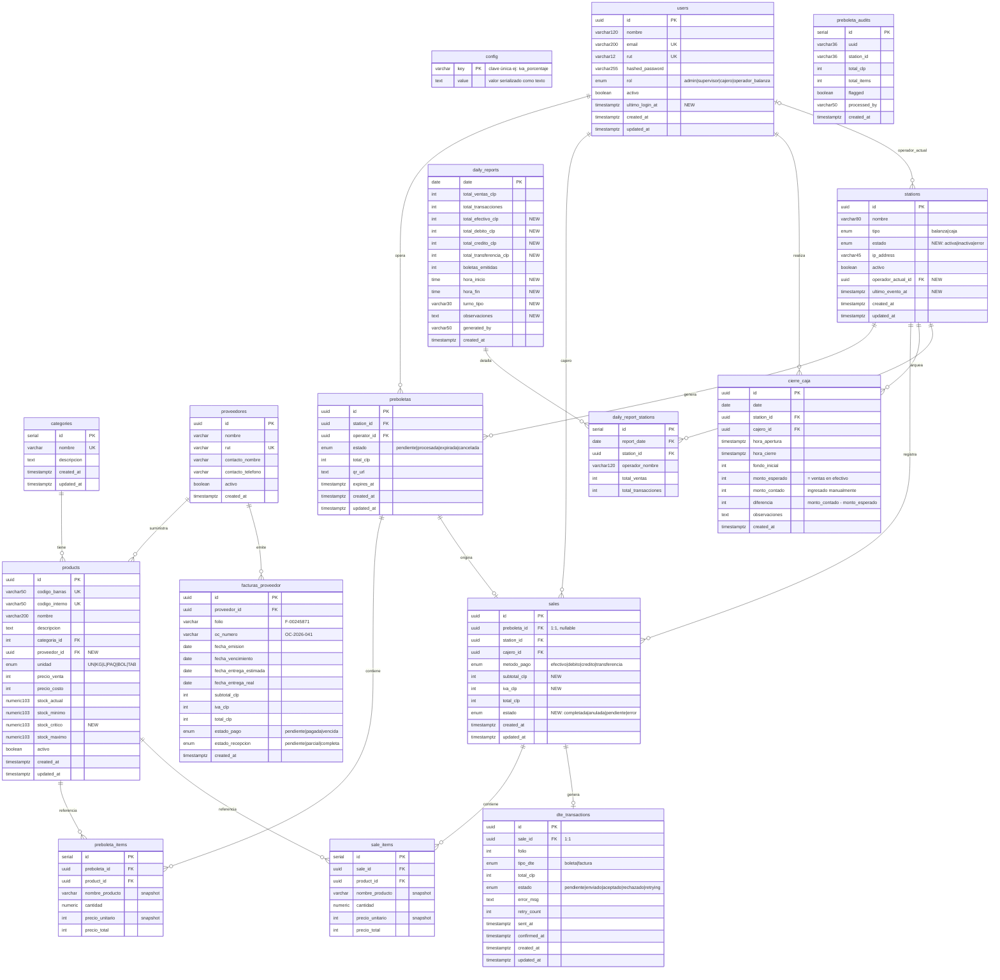

# Modelo Relacional — Emporio Esperanza
## ERD Completo + DDL PostgreSQL

**Versión:** 1.0  
**Fecha:** 2026-04-19  
**Base:** Análisis UI → Backend (PROVISIONAL_DB_VARIABLES.md)  
**Motor:** PostgreSQL 15 con UUID, ENUM nativos

---

## Resumen de Tablas

| # | Tabla | Estado | Descripción |
|---|-------|--------|-------------|
| 1 | `config` | 🆕 Nueva | Configuración del negocio (key-value) |
| 2 | `users` | ✏️ Modificada | Usuarios del sistema (+ ultimo_login_at) |
| 3 | `categories` | ✅ Sin cambios | Categorías de productos |
| 4 | `proveedores` | 🆕 Nueva | Proveedores / distribuidores |
| 5 | `products` | ✏️ Modificada | Productos (+ stock_critico, proveedor_id) |
| 6 | `stations` | ✏️ Modificada | Balanzas y cajas (+ estado, operador, ultimo_evento) |
| 7 | `preboletas` | ✅ Sin cambios | Pre-boletas generadas por balanza |
| 8 | `preboleta_items` | ✅ Sin cambios | Items de pre-boleta |
| 9 | `preboleta_audits` | ✅ Sin cambios | Auditoría de pre-boletas |
| 10 | `sales` | ✏️ Modificada | Ventas completadas (+ subtotal, iva, estado) |
| 11 | `sale_items` | ✅ Sin cambios | Items de venta (snapshot) |
| 12 | `dte_transactions` | ✅ Sin cambios | Boletas/facturas electrónicas SII |
| 13 | `daily_reports` | ✏️ Modificada | Resumen diario (+ desglose por método de pago) |
| 14 | `daily_report_stations` | 🆕 Nueva | Resumen diario por estación |
| 15 | `cierre_caja` | 🆕 Nueva | Arqueo de caja diario |
| 16 | `facturas_proveedor` | 🆕 Nueva | Facturas de proveedores |

---

## Diagrama ERD (Mermaid)



---

## DDL PostgreSQL Completo

### ENUMs

```sql
-- ENUMs nuevos (agregar a la migración)
CREATE TYPE station_estado AS ENUM ('activa', 'inactiva', 'error');
CREATE TYPE sale_estado    AS ENUM ('completada', 'anulada', 'pendiente', 'error');
CREATE TYPE estado_pago_fp AS ENUM ('pendiente', 'pagada', 'vencida');
CREATE TYPE estado_rec_fp  AS ENUM ('pendiente', 'parcial', 'completa');

-- ENUMs existentes (ya creados en migración inicial)
-- user_role: admin | supervisor | cajero | operador_balanza
-- station_type: balanza | caja
-- unidad_type: UN | KG | L | PAQ | BOL | TAB
-- preboleta_estado: pendiente | procesada | expirada | cancelada
-- metodo_pago: efectivo | debito | credito | transferencia
-- tipo_dte: boleta | factura
-- dte_estado: pendiente | enviado | aceptado | rechazado | retrying
```

---

### 1. `config` — Configuración del negocio

```sql
CREATE TABLE config (
    key   VARCHAR(100) PRIMARY KEY,
    value TEXT         NOT NULL
);

-- Seed obligatorio:
INSERT INTO config (key, value) VALUES
    ('negocio_nombre',            'Emporio Esperanza'),
    ('negocio_subtitulo',         'Sistema de punto de venta'),
    ('iva_porcentaje',            '19'),
    ('fondo_inicial_caja_default','50000'),
    ('vendor_nombre',             'OptiMind Solutions AI');
```

---

### 2. `users` — Usuarios (modificada)

```sql
-- Tabla existente — agregar columna:
ALTER TABLE users
    ADD COLUMN ultimo_login_at TIMESTAMPTZ;
```

Schema completo:
```sql
CREATE TABLE users (
    id              UUID        PRIMARY KEY DEFAULT gen_random_uuid(),
    nombre          VARCHAR(120) NOT NULL,
    email           VARCHAR(200) NOT NULL UNIQUE,
    rut             VARCHAR(12)  UNIQUE,
    hashed_password VARCHAR(255) NOT NULL,
    rol             user_role    NOT NULL DEFAULT 'cajero',
    activo          BOOLEAN      NOT NULL DEFAULT TRUE,
    ultimo_login_at TIMESTAMPTZ,               -- NEW
    created_at      TIMESTAMPTZ NOT NULL DEFAULT NOW(),
    updated_at      TIMESTAMPTZ NOT NULL DEFAULT NOW()
);
CREATE INDEX idx_users_email  ON users (email);
CREATE INDEX idx_users_rol    ON users (rol);
```

---

### 3. `categories` — Categorías (sin cambios)

```sql
CREATE TABLE categories (
    id          SERIAL       PRIMARY KEY,
    nombre      VARCHAR(100) NOT NULL UNIQUE,
    descripcion TEXT,
    created_at  TIMESTAMPTZ  NOT NULL DEFAULT NOW(),
    updated_at  TIMESTAMPTZ  NOT NULL DEFAULT NOW()
);
```

---

### 4. `proveedores` — Proveedores (nueva)

```sql
CREATE TABLE proveedores (
    id                UUID        PRIMARY KEY DEFAULT gen_random_uuid(),
    nombre            VARCHAR(200) NOT NULL,
    rut               VARCHAR(12)  NOT NULL UNIQUE,
    contacto_nombre   VARCHAR(120),
    contacto_telefono VARCHAR(20),
    activo            BOOLEAN      NOT NULL DEFAULT TRUE,
    created_at        TIMESTAMPTZ  NOT NULL DEFAULT NOW()
);
CREATE INDEX idx_proveedores_rut ON proveedores (rut);
```

---

### 5. `products` — Productos (modificada)

```sql
-- Tabla existente — agregar columnas:
ALTER TABLE products
    ADD COLUMN stock_critico NUMERIC(10,3) NOT NULL DEFAULT 0,
    ADD COLUMN proveedor_id  UUID REFERENCES proveedores(id) ON DELETE SET NULL;

CREATE INDEX idx_products_proveedor ON products (proveedor_id);
```

Schema completo:
```sql
CREATE TABLE products (
    id              UUID         PRIMARY KEY DEFAULT gen_random_uuid(),
    codigo_barras   VARCHAR(50)  UNIQUE,
    codigo_interno  VARCHAR(50)  UNIQUE,
    nombre          VARCHAR(200) NOT NULL,
    descripcion     TEXT,
    categoria_id    INT          REFERENCES categories(id) ON DELETE SET NULL,
    proveedor_id    UUID         REFERENCES proveedores(id) ON DELETE SET NULL, -- NEW
    unidad          unidad_type  NOT NULL DEFAULT 'UN',
    precio_venta    INT          NOT NULL DEFAULT 0,
    precio_costo    INT          NOT NULL DEFAULT 0,
    stock_actual    NUMERIC(10,3) NOT NULL DEFAULT 0,
    stock_minimo    NUMERIC(10,3) NOT NULL DEFAULT 0,
    stock_critico   NUMERIC(10,3) NOT NULL DEFAULT 0,  -- NEW
    stock_maximo    NUMERIC(10,3),
    activo          BOOLEAN      NOT NULL DEFAULT TRUE,
    created_at      TIMESTAMPTZ  NOT NULL DEFAULT NOW(),
    updated_at      TIMESTAMPTZ  NOT NULL DEFAULT NOW()
);
CREATE INDEX idx_products_nombre     ON products (nombre);
CREATE INDEX idx_products_codigo_bar ON products (codigo_barras);
CREATE INDEX idx_products_categoria  ON products (categoria_id);
CREATE INDEX idx_products_proveedor  ON products (proveedor_id);
```

---

### 6. `stations` — Estaciones (modificada)

```sql
-- Tabla existente — agregar columnas:
ALTER TABLE stations
    ADD COLUMN estado             station_estado NOT NULL DEFAULT 'inactiva',
    ADD COLUMN operador_actual_id UUID           REFERENCES users(id) ON DELETE SET NULL,
    ADD COLUMN ultimo_evento_at   TIMESTAMPTZ;
```

Schema completo:
```sql
CREATE TABLE stations (
    id                  UUID           PRIMARY KEY DEFAULT gen_random_uuid(),
    nombre              VARCHAR(80)    NOT NULL,
    tipo                station_type   NOT NULL,
    estado              station_estado NOT NULL DEFAULT 'inactiva', -- NEW
    ip_address          VARCHAR(45),
    activo              BOOLEAN        NOT NULL DEFAULT TRUE,
    operador_actual_id  UUID           REFERENCES users(id) ON DELETE SET NULL, -- NEW
    ultimo_evento_at    TIMESTAMPTZ,                                             -- NEW
    created_at          TIMESTAMPTZ    NOT NULL DEFAULT NOW(),
    updated_at          TIMESTAMPTZ    NOT NULL DEFAULT NOW()
);
```

---

### 7. `preboletas` — Pre-boletas (sin cambios)

```sql
CREATE TABLE preboletas (
    id          UUID             PRIMARY KEY DEFAULT gen_random_uuid(),
    station_id  UUID             NOT NULL REFERENCES stations(id),
    operator_id UUID             REFERENCES users(id) ON DELETE SET NULL,
    estado      preboleta_estado NOT NULL DEFAULT 'pendiente',
    total_clp   INT              NOT NULL DEFAULT 0,
    qr_url      TEXT,
    expires_at  TIMESTAMPTZ,
    created_at  TIMESTAMPTZ      NOT NULL DEFAULT NOW(),
    updated_at  TIMESTAMPTZ      NOT NULL DEFAULT NOW()
);
CREATE INDEX idx_preboletas_station ON preboletas (station_id);
CREATE INDEX idx_preboletas_estado  ON preboletas (estado);
```

---

### 8. `preboleta_items` — Items de pre-boleta (sin cambios)

```sql
CREATE TABLE preboleta_items (
    id              SERIAL       PRIMARY KEY,
    preboleta_id    UUID         NOT NULL REFERENCES preboletas(id) ON DELETE CASCADE,
    product_id      UUID         REFERENCES products(id) ON DELETE SET NULL,
    nombre_producto VARCHAR(200) NOT NULL,
    cantidad        NUMERIC      NOT NULL,
    precio_unitario INT          NOT NULL,
    precio_total    INT          NOT NULL
);
CREATE INDEX idx_preboleta_items_preboleta ON preboleta_items (preboleta_id);
```

---

### 9. `preboleta_audits` — Auditoría (sin cambios)

```sql
CREATE TABLE preboleta_audits (
    id           SERIAL       PRIMARY KEY,
    uuid         VARCHAR(36)  NOT NULL,
    station_id   VARCHAR(36)  NOT NULL,
    total_clp    INT          NOT NULL,
    total_items  INT          NOT NULL,
    flagged      BOOLEAN      NOT NULL DEFAULT FALSE,
    processed_by VARCHAR(50)  NOT NULL DEFAULT 'backend',
    created_at   TIMESTAMPTZ  NOT NULL
);
CREATE INDEX idx_preboleta_audits_uuid ON preboleta_audits (uuid);
```

---

### 10. `sales` — Ventas (modificada)

```sql
-- Tabla existente — agregar columnas:
ALTER TABLE sales
    ADD COLUMN subtotal_clp INT        DEFAULT 0,
    ADD COLUMN iva_clp      INT        DEFAULT 0,
    ADD COLUMN estado       sale_estado NOT NULL DEFAULT 'completada';
```

Schema completo:
```sql
CREATE TABLE sales (
    id           UUID        PRIMARY KEY DEFAULT gen_random_uuid(),
    preboleta_id UUID        UNIQUE REFERENCES preboletas(id) ON DELETE SET NULL,
    station_id   UUID        NOT NULL REFERENCES stations(id),
    cajero_id    UUID        REFERENCES users(id) ON DELETE SET NULL,
    metodo_pago  metodo_pago NOT NULL DEFAULT 'efectivo',
    subtotal_clp INT         NOT NULL DEFAULT 0,   -- NEW
    iva_clp      INT         NOT NULL DEFAULT 0,   -- NEW
    total_clp    INT         NOT NULL,
    estado       sale_estado NOT NULL DEFAULT 'completada', -- NEW
    created_at   TIMESTAMPTZ NOT NULL DEFAULT NOW(),
    updated_at   TIMESTAMPTZ NOT NULL DEFAULT NOW()
);
CREATE INDEX idx_sales_station    ON sales (station_id);
CREATE INDEX idx_sales_created_at ON sales (created_at DESC);
CREATE INDEX idx_sales_estado     ON sales (estado);
```

---

### 11. `sale_items` — Items de venta (sin cambios)

```sql
CREATE TABLE sale_items (
    id              SERIAL       PRIMARY KEY,
    sale_id         UUID         NOT NULL REFERENCES sales(id) ON DELETE CASCADE,
    product_id      UUID         REFERENCES products(id) ON DELETE SET NULL,
    nombre_producto VARCHAR(200) NOT NULL,
    cantidad        NUMERIC      NOT NULL,
    precio_unitario INT          NOT NULL,
    precio_total    INT          NOT NULL
);
CREATE INDEX idx_sale_items_sale    ON sale_items (sale_id);
CREATE INDEX idx_sale_items_product ON sale_items (product_id);
```

---

### 12. `dte_transactions` — Boletas SII (sin cambios)

```sql
CREATE TABLE dte_transactions (
    id           UUID      PRIMARY KEY DEFAULT gen_random_uuid(),
    sale_id      UUID      NOT NULL UNIQUE REFERENCES sales(id) ON DELETE CASCADE,
    folio        INT,
    tipo_dte     tipo_dte  NOT NULL DEFAULT 'boleta',
    total_clp    INT       NOT NULL,
    estado       dte_estado NOT NULL DEFAULT 'pendiente',
    error_msg    TEXT,
    retry_count  INT       NOT NULL DEFAULT 0,
    sent_at      TIMESTAMPTZ,
    confirmed_at TIMESTAMPTZ,
    created_at   TIMESTAMPTZ NOT NULL DEFAULT NOW(),
    updated_at   TIMESTAMPTZ NOT NULL DEFAULT NOW()
);
CREATE INDEX idx_dte_estado ON dte_transactions (estado);
CREATE INDEX idx_dte_folio  ON dte_transactions (folio);
```

---

### 13. `daily_reports` — Reportes diarios (modificada)

```sql
-- Tabla existente — agregar columnas:
ALTER TABLE daily_reports
    ADD COLUMN total_efectivo_clp      INT  NOT NULL DEFAULT 0,
    ADD COLUMN total_debito_clp        INT  NOT NULL DEFAULT 0,
    ADD COLUMN total_credito_clp       INT  NOT NULL DEFAULT 0,
    ADD COLUMN total_transferencia_clp INT  NOT NULL DEFAULT 0,
    ADD COLUMN hora_inicio             TIME,
    ADD COLUMN hora_fin                TIME,
    ADD COLUMN turno_tipo              VARCHAR(30),
    ADD COLUMN observaciones           TEXT;
```

Schema completo:
```sql
CREATE TABLE daily_reports (
    date                    DATE        PRIMARY KEY,
    total_ventas_clp        INT         NOT NULL DEFAULT 0,
    total_transacciones     INT         NOT NULL DEFAULT 0,
    total_efectivo_clp      INT         NOT NULL DEFAULT 0,  -- NEW
    total_debito_clp        INT         NOT NULL DEFAULT 0,  -- NEW
    total_credito_clp       INT         NOT NULL DEFAULT 0,  -- NEW
    total_transferencia_clp INT         NOT NULL DEFAULT 0,  -- NEW
    boletas_emitidas        INT         NOT NULL DEFAULT 0,
    hora_inicio             TIME,                             -- NEW
    hora_fin                TIME,                             -- NEW
    turno_tipo              VARCHAR(30),                      -- NEW
    observaciones           TEXT,                             -- NEW
    generated_by            VARCHAR(50) NOT NULL DEFAULT 'celery',
    created_at              TIMESTAMPTZ NOT NULL DEFAULT NOW()
);
```

---

### 14. `daily_report_stations` — Resumen por estación (nueva)

```sql
CREATE TABLE daily_report_stations (
    id                  SERIAL       PRIMARY KEY,
    report_date         DATE         NOT NULL REFERENCES daily_reports(date) ON DELETE CASCADE,
    station_id          UUID         NOT NULL REFERENCES stations(id),
    operador_nombre     VARCHAR(120),
    total_ventas        INT          NOT NULL DEFAULT 0,
    total_transacciones INT          NOT NULL DEFAULT 0,
    UNIQUE (report_date, station_id)
);
CREATE INDEX idx_drs_report_date ON daily_report_stations (report_date);
CREATE INDEX idx_drs_station     ON daily_report_stations (station_id);
```

---

### 15. `cierre_caja` — Arqueo de caja (nueva)

```sql
CREATE TABLE cierre_caja (
    id              UUID        PRIMARY KEY DEFAULT gen_random_uuid(),
    date            DATE        NOT NULL,
    station_id      UUID        NOT NULL REFERENCES stations(id),
    cajero_id       UUID        REFERENCES users(id) ON DELETE SET NULL,
    hora_apertura   TIMESTAMPTZ,
    hora_cierre     TIMESTAMPTZ,
    fondo_inicial   INT         NOT NULL DEFAULT 0,
    monto_esperado  INT         NOT NULL DEFAULT 0,
    monto_contado   INT,
    diferencia      INT GENERATED ALWAYS AS (monto_contado - monto_esperado) STORED,
    observaciones   TEXT,
    created_at      TIMESTAMPTZ NOT NULL DEFAULT NOW(),
    UNIQUE (date, station_id)
);
CREATE INDEX idx_cierre_caja_date    ON cierre_caja (date);
CREATE INDEX idx_cierre_caja_station ON cierre_caja (station_id);
```

---

### 16. `facturas_proveedor` — Facturas de proveedores (nueva)

```sql
CREATE TABLE facturas_proveedor (
    id                     UUID           PRIMARY KEY DEFAULT gen_random_uuid(),
    proveedor_id           UUID           NOT NULL REFERENCES proveedores(id),
    folio                  VARCHAR(20)    NOT NULL,
    oc_numero              VARCHAR(20),
    fecha_emision          DATE           NOT NULL,
    fecha_vencimiento      DATE,
    fecha_entrega_estimada DATE,
    fecha_entrega_real     DATE,
    subtotal_clp           INT            NOT NULL,
    iva_clp                INT            NOT NULL,
    total_clp              INT            NOT NULL,
    estado_pago            estado_pago_fp NOT NULL DEFAULT 'pendiente',
    estado_recepcion       estado_rec_fp  NOT NULL DEFAULT 'pendiente',
    created_at             TIMESTAMPTZ    NOT NULL DEFAULT NOW(),
    UNIQUE (proveedor_id, folio)
);
CREATE INDEX idx_fp_proveedor    ON facturas_proveedor (proveedor_id);
CREATE INDEX idx_fp_estado_pago  ON facturas_proveedor (estado_pago);
CREATE INDEX idx_fp_vencimiento  ON facturas_proveedor (fecha_vencimiento);
```

---

## Invariantes de negocio

```sql
-- total_clp debe ser igual a subtotal + iva
ALTER TABLE sales ADD CONSTRAINT chk_sales_total
    CHECK (total_clp = subtotal_clp + iva_clp);

-- stock_critico <= stock_minimo (lógica de alertas)
ALTER TABLE products ADD CONSTRAINT chk_stock_umbrales
    CHECK (stock_critico <= stock_minimo);

-- diferencia de caja calculada automáticamente (columna GENERATED)
-- ver cierre_caja.diferencia arriba

-- total factura = subtotal + iva
ALTER TABLE facturas_proveedor ADD CONSTRAINT chk_fp_total
    CHECK (total_clp = subtotal_clp + iva_clp);
```

---

## Queries frecuentes del sistema

```sql
-- Dashboard: ventas de hoy por estación
SELECT s.nombre, COUNT(sa.id) AS transacciones, SUM(sa.total_clp) AS ventas
FROM stations s
LEFT JOIN sales sa ON sa.station_id = s.id AND sa.created_at::date = CURRENT_DATE
GROUP BY s.id, s.nombre;

-- POS: estado de stock con semáforo
SELECT nombre, stock_actual, stock_minimo, stock_critico,
    CASE
        WHEN stock_actual = 0                        THEN 'out_of_stock'
        WHEN stock_actual <= stock_critico           THEN 'critical'
        WHEN stock_actual <= stock_minimo            THEN 'low'
        ELSE                                              'ok'
    END AS stock_estado
FROM products WHERE activo = TRUE;

-- Cierre: desglose de ventas por método de pago
SELECT metodo_pago, COUNT(*) AS transacciones, SUM(total_clp) AS total
FROM sales
WHERE created_at::date = CURRENT_DATE AND estado = 'completada'
GROUP BY metodo_pago;

-- Proveedores: facturas vencidas
SELECT fp.folio, p.nombre, fp.total_clp, fp.fecha_vencimiento
FROM facturas_proveedor fp
JOIN proveedores p ON p.id = fp.proveedor_id
WHERE fp.estado_pago = 'pendiente' AND fp.fecha_vencimiento < CURRENT_DATE;

-- Top 5 productos del día
SELECT si.nombre_producto, COUNT(si.id) AS transacciones,
       SUM(si.cantidad) AS unidades_vendidas, SUM(si.precio_total) AS total_clp
FROM sale_items si
JOIN sales s ON s.id = si.sale_id
WHERE s.created_at::date = CURRENT_DATE AND s.estado = 'completada'
GROUP BY si.nombre_producto
ORDER BY total_clp DESC LIMIT 5;
```

---

## Orden de migración Alembic

El orden respeta las dependencias de FK:

```
1. config                   (sin dependencias)
2. users                    (sin dependencias)
3. categories               (sin dependencias)
4. proveedores              (sin dependencias)
5. products                 (→ categories, proveedores)
6. stations                 (→ users)
7. preboletas               (→ stations, users)
8. preboleta_items          (→ preboletas, products)
9. preboleta_audits         (sin FK de modelo)
10. sales                   (→ preboletas, stations, users)
11. sale_items              (→ sales, products)
12. dte_transactions        (→ sales)
13. daily_reports           (sin dependencias)
14. daily_report_stations   (→ daily_reports, stations)
15. cierre_caja             (→ stations, users)
16. facturas_proveedor      (→ proveedores)
```

---

**Autor:** Allan Luco  
**Revisado con:** Claude Sonnet 4.6  
**Próxima revisión:** Antes de Sprint 1 (post validación con frontend)
